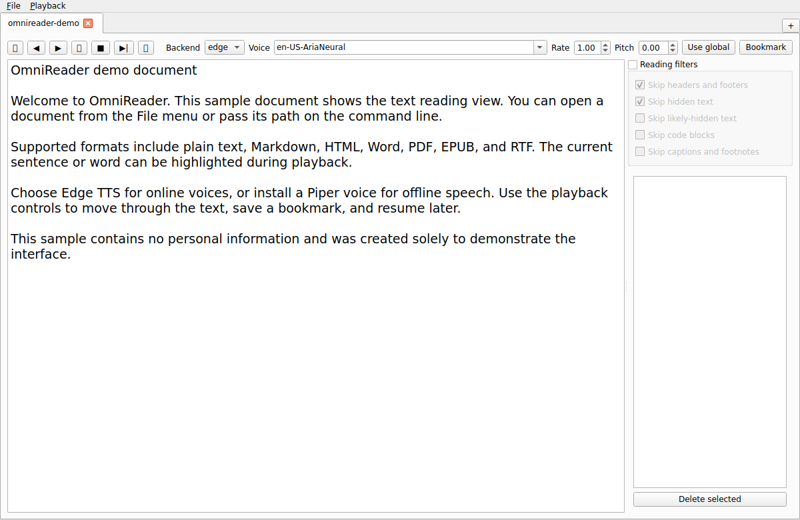

# OmniReader

OmniReader reads documents aloud on Linux. Open a file, choose an Edge TTS or
local Piper voice, and follow along with sentence or word highlighting. It
remembers your tabs, bookmarks, filters, voices, and reading positions. Opening
a document does not modify the original file.

**Formats:** plain text (`.txt`), Markdown (`.md`), HTML (`.html`, `.htm`),
Word (`.docx`, legacy `.doc`), PDF (`.pdf`), EPUB (`.epub`), and RTF (`.rtf`).
Legacy `.doc` files require LibreOffice. PDFs need extractable text; this app
does not OCR image-only scans.

**Voice choice:** Edge TTS needs a network connection. Piper can work offline
after you install a voice model. OmniReader falls back to another available
backend when one is unavailable.

This is an early `0.1.x` release. See the [changelog](CHANGELOG.md) for recent
fixes and [report problems](https://github.com/Monotoba/OmniReader/issues/new/choose)
with the document format, Linux distribution, and steps to reproduce.



*OmniReader running on Linux with a sample text document. The image shows the
reading interface; audio playback is not demonstrated in this screenshot.*

## Install and run

Python 3.10 or newer is required. Linux audio playback requires `ffplay`
(normally provided by `ffmpeg`) or `mpv`. On Ubuntu/Debian, install the audio
player and Python virtual environment support:

```bash
sudo apt install ffmpeg python3-venv
```

Clone the source and install OmniReader in a virtual environment:

```bash
git clone https://github.com/Monotoba/OmniReader.git
cd OmniReader
python -m venv .venv
. .venv/bin/activate
python -m pip install -e .
omnireader
```

The install commands run from the repository root (the directory containing
`pyproject.toml`). To open a document immediately, run
`omnireader /path/to/document.pdf`. You can also open documents from the app.
After installation, `python -m omnireader` is equivalent to `omnireader`.

For a source-tree launch without installation, use either of these from the
repository root:

```bash
PYTHONPATH=src python -m omnireader
python src/omnireader/main.py
```

The convenience scripts always locate the repository root and activate its
`.venv` before running. They fail with setup instructions if the environment or
development tools are missing:

```bash
./scripts/run.sh [document ...]
./scripts/test.sh
```

Set `OMNIREADER_VENV=/path/to/venv` to use a different virtual environment.
Activation applies to the script process and the application/test process it
starts; a child script cannot alter the calling shell's environment.

On Linux, synthesized audio plays in an `ffplay`/`mpv` child process. This
isolates OmniReader from native multimedia crashes and supports both PulseAudio
and PipeWire's PulseAudio compatibility service. Audio service failures appear
as playback errors instead of terminating the application.

Piper is optional. Put matching `*.onnx` and `*.onnx.json` voice files in
`~/.local/share/omnireader/piper-voices/`, then install `piper-tts` or place a
`piper` executable on `PATH`. Edge TTS requires a network connection. Legacy
`.doc` conversion requires LibreOffice (`soffice`). Every optional integration
is detected at runtime and fails with an actionable message.

The library database and generated audio cache live below the platform data and
cache directories. Override them for testing with `OMNIREADER_DATA_DIR` and
`OMNIREADER_CACHE_DIR`.

## Development

Install the development dependencies with `python -m pip install -e '.[dev]'`
in the active virtual environment, then run:

```bash
python -m pytest
ruff check src tests
mypy src/omnireader
```

See [CONTRIBUTING.md](CONTRIBUTING.md) for issue reports, changes, and pull
requests.

`scripts/git-local` behaves like `git` from the project root. It also supports
managed workspaces that keep repository metadata in `.git-local`.

## Automation

GitHub Actions runs linting, type checks, tests on Python 3.10/3.12/3.13, and
distribution validation for every push and pull request. Dependabot checks
Python and Actions dependencies monthly.

Pushing a tag matching the package version creates a GitHub Release containing
the verified wheel and source distribution:

```bash
git tag v0.1.0
git push origin v0.1.0
```

The release workflow rejects a tag that does not match `[project].version`.

The complete product specification is in
[`docs/omnireader-spec.md`](docs/omnireader-spec.md).

## License

MIT
